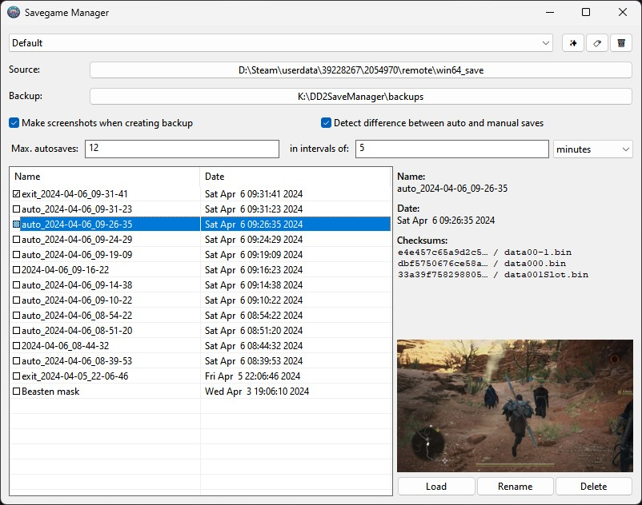

# Savegame Manager

Inspired by [Lennard Fonteijn's DD2 Save Manager](https://www.nexusmods.com/dragonsdogma2/mods/52). Build in Rust without the need to install extra dependencies.

It will watch a folder and backup the files into a subfolder when the files change. It creates a screenshot with the backup to make finding the right save easier.

In most cases it's advisable to deactivate Steam's cloud saves for the game in question before using this.

You may get a notification from Windows SmartScreen, informing you about that is was unable to verify the source of the executable. That is because I did not sign the executable, because a code signing certificate is quite expensive and not worth getting for the few hobby projects I do. You can execute anyway by clicking "more information". Please make sure you do not execute anything from untrusted sources.

[Download the latest version on the Releases page.](https://github.com/PakL/savegame_manager/releases/latest)